# **Traffic Sign Recognition** 

## Writeup

### You can use this file as a template for your writeup if you want to submit it as a markdown file, but feel free to use some other method and submit a pdf if you prefer.

---

**Build a Traffic Sign Recognition Project**

The goals / steps of this project are the following:
* Load the data set (see below for links to the project data set)
* Explore, summarize and visualize the data set
* Design, train and test a model architecture
* Use the model to make predictions on new images
* Analyze the softmax probabilities of the new images
* Summarize the results with a written report

[//]: # (Image References)

[image1]: ./examples/visualization.jpg "Visualization"
[image2]: ./examples/grayscale.jpg "Grayscaling"
[image3]: ./examples/random_noise.jpg "Random Noise"
[image4]: ./examples/placeholder.png "Traffic Sign 1"
[image5]: ./examples/placeholder.png "Traffic Sign 2"
[image6]: ./examples/placeholder.png "Traffic Sign 3"
[image7]: ./examples/placeholder.png "Traffic Sign 4"
[image8]: ./examples/placeholder.png "Traffic Sign 5"

## Rubric Points
### Here I will consider the [rubric points](https://review.udacity.com/#!/rubrics/481/view) individually and describe how I addressed each point in my implementation.  

---
### Writeup / README

#### 1. Provide a Writeup / README that includes all the rubric points and how you addressed each one. You can submit your writeup as markdown or pdf. You can use this template as a guide for writing the report. The submission includes the project code.

You're reading it! and here is a link to my [project code](https://github.com/udacity/CarND-Traffic-Sign-Classifier-Project/blob/master/Traffic_Sign_Classifier.ipynb)

### Data Set Summary & Exploration

#### 1. Provide a basic summary of the data set. In the code, the analysis should be done using python, numpy and/or pandas methods rather than hardcoding results manually.

I used the pandas library to calculate summary statistics of the traffic
signs data set:

* The size of training set is 34799
* The size of the validation set is 4410
* The size of test set is 12630
* The shape of a traffic sign image is (32, 32, 3)
* The number of unique classes/labels in the data set is 43

#### 2. Include an exploratory visualization of the dataset.

##### Here is a visualization of 3 images from the training, validation and test data sets:

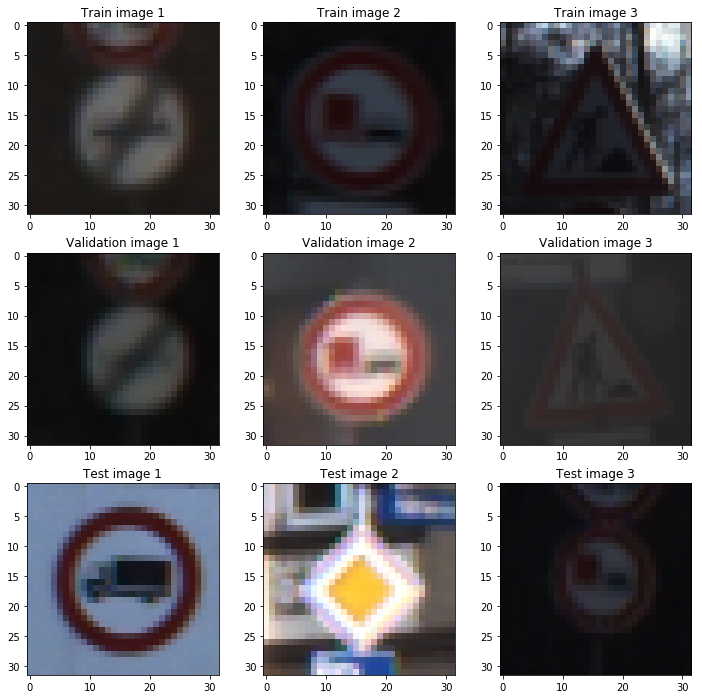

It can be seen that:

- Some images are dark / dimmed
- Some images are either slightly rotated (Validation image 3) or taken under the angle (Train image 3)

This information should be taken into account during the data normalization and augmentation steps.

##### Here is a visualization of training sample distribution per class for training, validation and test data sets:

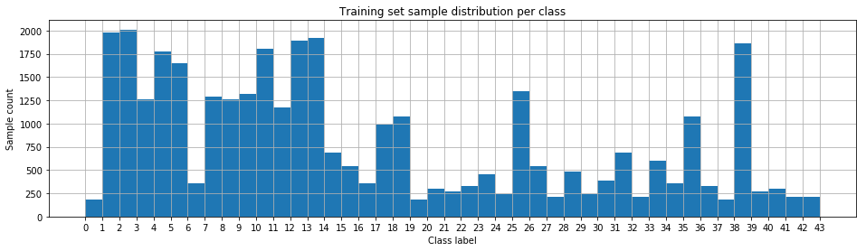

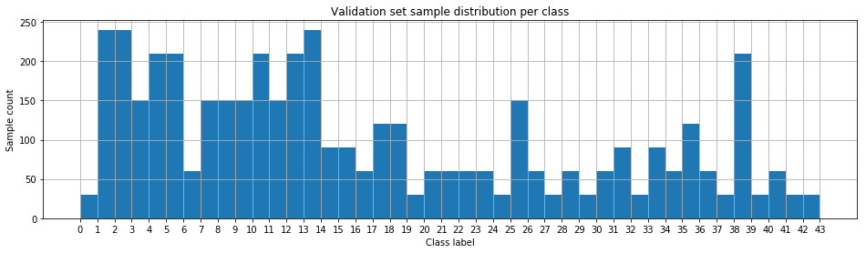

It can be seen that all three data sets are highly imbalanced - for example, there are less than 250 samples for label `0` but more than `2000` samples for label `2` in the training set.

### Design and Test a Model Architecture

#### 1. Describe how you preprocessed the image data. What techniques were chosen and why did you choose these techniques? Consider including images showing the output of each preprocessing technique. Pre-processing refers to techniques such as converting to grayscale, normalization, etc. (OPTIONAL: As described in the "Stand Out Suggestions" part of the rubric, if you generated additional data for training, describe why you decided to generate additional data, how you generated the data, and provide example images of the additional data. Then describe the characteristics of the augmented training set like number of images in the set, number of images for each class, etc.)

The pre-processing pipeline consisted of normalization and augmentation steps.

#### Normalization

1. Convert the image to grayscale. This reduces the dimensionality of the data and makes the model more robust to the new images which may have different color due to lighting conditions or image quality (weight sharing):

    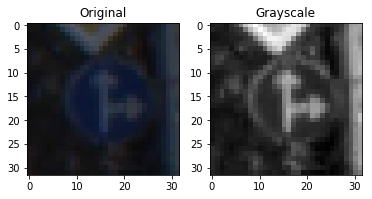

2. Apply the [histogram normalization](https://en.wikipedia.org/wiki/Histogram_equalization) in order to improve image contrast, which will make the traffic sign features more pronounced:

    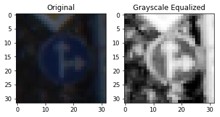
    
3. Normalize the image in order to speed up the optimization process:

    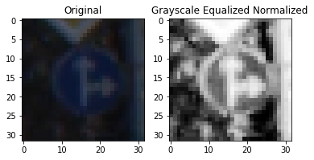

##### Training data set augmentation

I decided to generate additional data because exploratory analysis has shown that the data set is highly imbalanced.

To add more data to the the data set, I used the following techniques because these are most commonly found in real images as well (bad image quality or lightning conditions (random noise) / camera angle relative to the traffic sign (rotation / shear))

1. Random noise:

    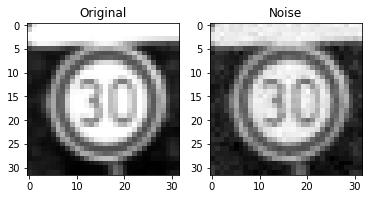
    
2. Random rotation:

    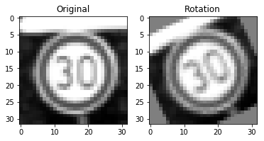
    
3. Random shear:

    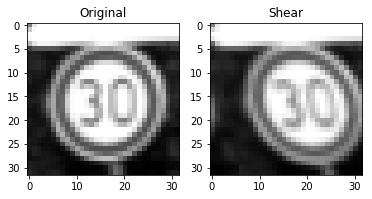

Augmented training set sample distribution per class:

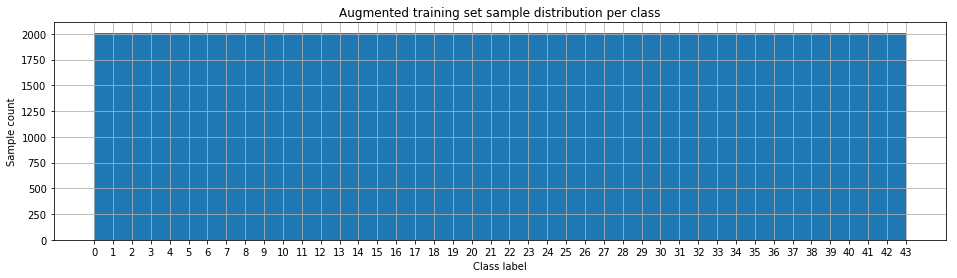

#### 2. Describe what your final model architecture looks like including model type, layers, layer sizes, connectivity, etc.) Consider including a diagram and/or table describing the final model.

My final model consisted of the following layers:

| Layer         		|     Description	        					| 
|:---------------------:|:---------------------------------------------:| 
| Input         		| 32x32 grayscale image   					    | 
| Convolution 5x5     	| 1x1 stride, valid padding, outputs 32x32x16	|
| RELU					|												|
| Max pooling	      	| 2x2 stride, valid padding, outputs 14x14x16 	|
| Convolution 5x5     	| 1x1 stride, valid padding, outputs 10x10x32	|
| RELU					|												|
| Max pooling	      	| 2x2 stride, valid padding, outputs 5x5x32 	|
| Fully connected		| outputs 120x1        						    |
| RELU					|												|
| Dropout				| keep probability = 0.75						|
| Fully connected		| outputs 84x1        						    |
| RELU					|												|
| Dropout				| keep probability = 0.75						|
| Softmax				| outputs 43x1        							|
 

#### 3. Describe how you trained your model. The discussion can include the type of optimizer, the batch size, number of epochs and any hyperparameters such as learning rate.

To train the model, I used an Adam optimizer, batch size of 128, 30 epochs and the learning rate of 0.001.

#### 4. Describe the approach taken for finding a solution and getting the validation set accuracy to be at least 0.93. Include in the discussion the results on the training, validation and test sets and where in the code these were calculated. Your approach may have been an iterative process, in which case, outline the steps you took to get to the final solution and why you chose those steps. Perhaps your solution involved an already well known implementation or architecture. In this case, discuss why you think the architecture is suitable for the current problem.

My final model results were:
* training set accuracy of 0.99
* validation set accuracy of 0.97
* test set accuracy of 0.95

I took an existing LeNet model and made a couple of changes to it:

Many traffic signs arguably have more complex shape than handwritten digits, hence more complex model is required. In order to accommodate that, I have increased the amount of CNN filters up to 16 in the 1st convolution layer and up to 32 in the 2nd. I have also added the dropout layer after the 1st and the 2nd fully connected layers to compensate overfitting.

Reasons for taking LeNet as a baseline were:

- I believed that an existing, "battle-proven" CNN model is a great starting point. 
- LeNet performs very well on similar data sets (low-res digit recognition)
- LeNet is very small compared to other CNN models such as Inception or VGG which will probably have prohibitive training times on computational resources, available to me.
- Initial experimentation has shown that the main bottleneck towards better accuracy was the data set imbalance rather than the model architecture.

Here is the training vs validation accuracy for every epoch:

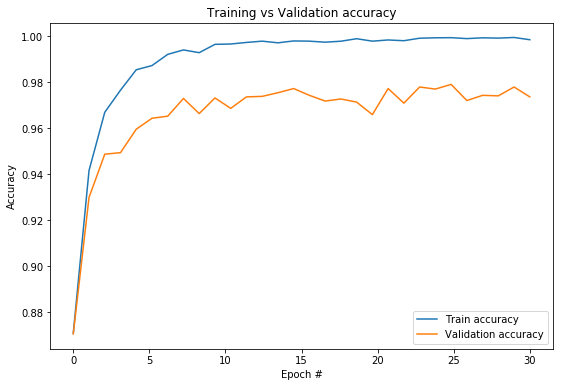

According to the chart, the model had overfit the training set after ~15 Epoch and the validation accuracy had converged to and oscilated around ~0.96.

### Test a Model on New Images

#### 1. Choose five German traffic signs found on the web and provide them in the report. For each image, discuss what quality or qualities might be difficult to classify.

Here are five German traffic signs that I found on the web. The left image is the original image, the right one is its normalized version:

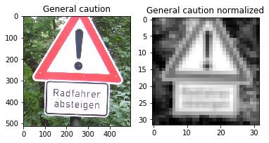
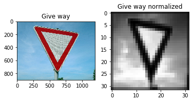
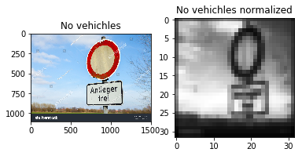
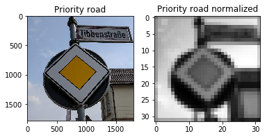
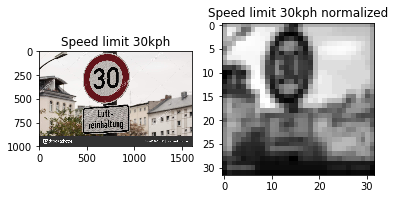

The first image might be difficult to classify because the actual traffic sign occupies only a small fraction of the image.

#### 2. Discuss the model's predictions on these new traffic signs and compare the results to predicting on the test set. At a minimum, discuss what the predictions were, the accuracy on these new predictions, and compare the accuracy to the accuracy on the test set (OPTIONAL: Discuss the results in more detail as described in the "Stand Out Suggestions" part of the rubric).

Here are the results of the prediction:

| Image			        |     Prediction	        					| 
|:---------------------:|:---------------------------------------------:| 
| General caution     	| Slippery road								    | 
| Yield     			| Yield 										|
| No vehicles			| Traffic signals								|
| Priority road      	| Priority road					 				|
| Speed limit (30km/h)	| Speed limit (30km/h)						    |

The model was able to correctly guess 3 of the 5 traffic signs, which gives an accuracy of 60%. However, it's hard to draw statistically significant conclusions from only 5 images from the web.

It should also be noted that some images were preprocessed rather poorly. For example, "Speed limit 30kph" got distorted as it's original aspect ratio is not square:

Ideally, we should have first localized and then cropped only the part of the image, which contains the traffic sign.

#### 3. Describe how certain the model is when predicting on each of the five new images by looking at the softmax probabilities for each prediction. Provide the top 5 softmax probabilities for each image along with the sign type of each probability. (OPTIONAL: as described in the "Stand Out Suggestions" part of the rubric, visualizations can also be provided such as bar charts)

The code for making predictions on my final model is located in the 21st cell of the Ipython notebook.

The model is surprisingly certain that the first image is "Slippery road", which is wrong:

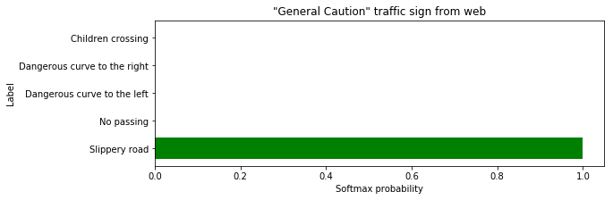

The model is very certain that the 2nd image is "Give way", which is correct:

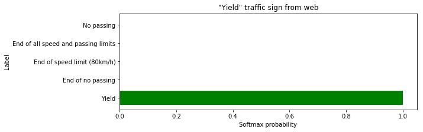

"No vehicles" is classified incorrectly and the correct label is not even in the top 5 softmax probabilities:

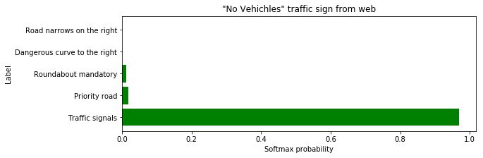

"Priority road" and "Speed limit 30 km/h" were classified correctly with negligible values for the rest of top 5 softmax probabilities:

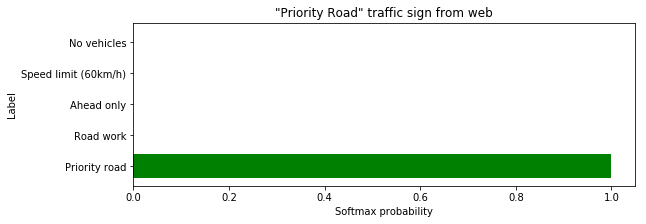
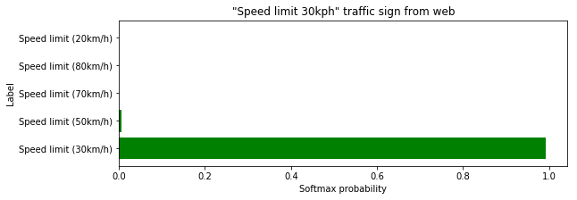
 					| 

### (Optional) Visualizing the Neural Network (See Step 4 of the Ipython notebook for more details)
#### 1. Discuss the visual output of your trained network's feature maps. What characteristics did the neural network use to make classifications?

